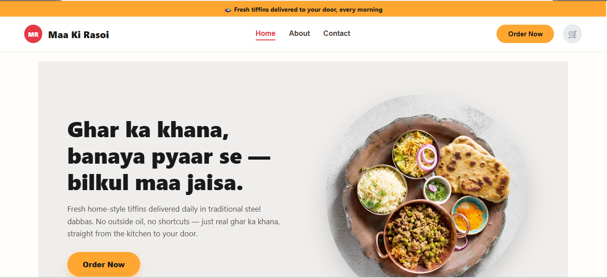
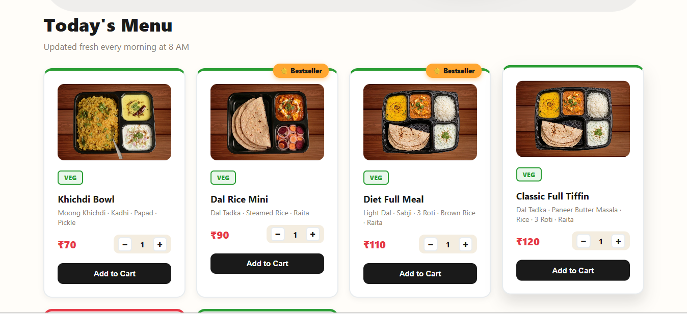
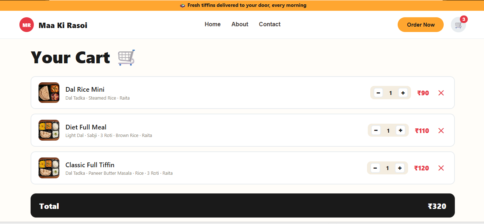
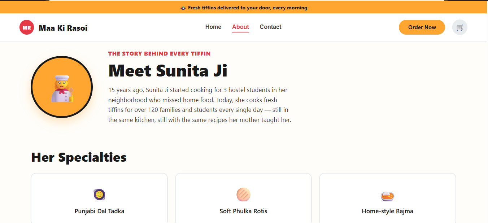
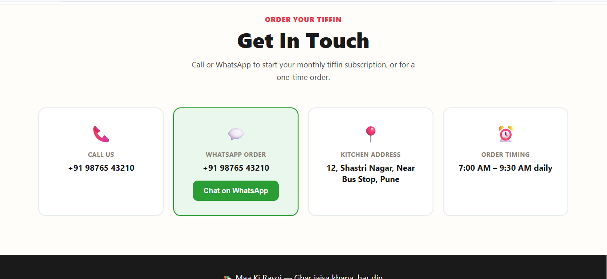

# 🍱 Maa Ki Rasoi — Homemade Food Ordering Website

<div align="center">

# 🍛 Maa Ki Rasoi

### *"Ghar Ka Khana, Bilkul Maa Jaisa"* ❤️

A responsive homemade food ordering website built using **React + Vite**.

<p align="center">
  
  
  
  
</p>

### 🌐 Live Website

<a href="https://maa-ki-rasoi-gamma.vercel.app">
  
</a>

<a href="https://github.com/apurva-chaudhari/maa-ki-rasoi">
  
</a>

</div>

---

## 📖 About the Project

**Maa Ki Rasoi** is a simple and modern food ordering website where users can explore delicious homemade meals and tiffin plans.

The project focuses on creating a clean, responsive, and user-friendly interface using **React components**, **Vite**, and **CSS**.

### 🎯 Project Highlights

* 🏠 Beautiful Landing Page
* 🍱 Daily Homemade Tiffin Plans
* 🍛 Menu Section with Meal Cards
* 🛒 Shopping Cart Interface
* 📞 Contact Information
* 👨‍🍳 About Maa Ki Rasoi
* 💬 WhatsApp Floating Button
* 📱 Fully Responsive Design

---

# 📸 Project Screenshots

## 🏠 Home Page

The landing page welcomes users with attractive branding and today's homemade food menu.

<p align="center">
  
</p>

---

## 🍽️ Menu & Tiffin Plans

Users can browse different tiffin plans and meal options.

<p align="center">
  
</p>

---

## 🛒 Shopping Cart

A clean shopping cart interface for adding and managing meals.

<p align="center">
  
</p>

---

## 👨‍🍳 About Maa Ki Rasoi

Information about homemade food quality and service.

<p align="center">
  
</p>

---

## 📞 Contact Page

Users can easily contact Maa Ki Rasoi for orders and support.

<p align="center">
  
</p>

---

# ✨ Features

| Feature          | Description                               |
| ---------------- | ----------------------------------------- |
| 🏠 Home Page     | Attractive landing page with hero section |
| 🍱 Tiffin Plans  | Classic, Mini, Premium & Special Tiffin   |
| 🍛 Menu Cards    | Homemade food menu with images            |
| 🛒 Cart          | Add and manage food items                 |
| 👨‍🍳 About      | About Maa Ki Rasoi section                |
| 📞 Contact       | Contact details and order information     |
| 💬 WhatsApp      | Floating WhatsApp order button            |
| 📱 Responsive UI | Mobile, Tablet and Desktop compatible     |

---

# 🛠️ Tech Stack

| Technology          | Purpose                     |
| ------------------- | --------------------------- |
| ⚛️ React            | Frontend UI                 |
| ⚡ Vite              | React Build Tool            |
| 🟨 JavaScript (ES6) | Application Logic           |
| 🌐 HTML5            | Structure                   |
| 🎨 CSS3             | Styling & Responsive Design |

---

# 📂 Project Structure

```text
maa-ki-rasoi/
│
├── public/
├── Screenshots/
│   ├── Home.png
│   ├── menu_plans.png
│   ├── Cart.png
│   ├── About.png
│   └── Contact.png
│
├── src/
│   ├── assets/
│   ├── components/
│   │   ├── Navbar.jsx
│   │   ├── Home.jsx
│   │   ├── Product.jsx
│   │   ├── Cart.jsx
│   │   ├── About.jsx
│   │   ├── Contact.jsx
│   │   ├── Footer.jsx
│   │   ├── Topbar.jsx
│   │   └── WhatsAppFloat.jsx
│   │
│   ├── data/
│   │   └── productInfo.js
│   │
│   ├── App.jsx
│   ├── App.css
│   ├── index.css
│   └── main.jsx
│
├── index.html
├── package.json
├── vite.config.js
└── README.md
```

---

# 🚀 Run Locally

### 1️⃣ Clone the Repository

```bash
git clone https://github.com/apurva-chaudhari/maa-ki-rasoi.git
```

### 2️⃣ Go to Project Folder

```bash
cd maa-ki-rasoi
```

### 3️⃣ Install Dependencies

```bash
npm install
```

### 4️⃣ Start Development Server

```bash
npm run dev
```

Open:

```text
http://localhost:5173
```

---

# 💻 What I Learned

This project helped me learn:

* React Components
* JSX
* Props
* State Management
* Project Folder Structure
* Asset Management
* Responsive CSS Design
* Git & GitHub Workflow
* Vercel Deployment

---

# 🚀 Future Improvements

* ❤️ Wishlist Feature
* 🔍 Food Search
* 🍱 Category Filter
* 💳 Online Payment Integration
* 👤 Login / Signup
* 📦 Order History
* ⭐ Customer Reviews

---

# 👩‍💻 Developer

<div align="center">

## **Apurva Chaudhari**

🎓 B.Tech Information Technology

🏫 Sipna College of Engineering, Amravati

💻 Aspiring Full Stack Web Developer

🌐 GitHub: **apurva-chaudhari**

</div>

---

<div align="center">

### ⭐ If you like this project, give it a Star on GitHub!

**Made with ❤️ using React + Vite**

</div>
